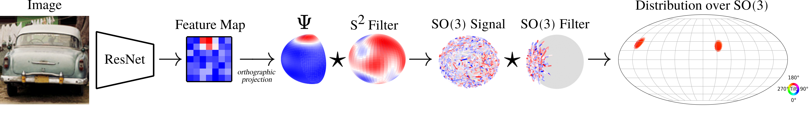

## Image to Sphere: Learning Equivariant Features for Efficient Pose Prediction
[Paper](https://openreview.net/forum?id=_2bDpAtr7PI) | [Project Page](https://dmklee.github.io/image2sphere/)

---------------------------------------------------------------------

This repository implements a hybrid equivariant model for SO(3) reasoning from 2D images for object pose estimation.
The underlying SO(3) symmetry of the pose estimation task is not accessible in an image, which can only be rotated in
plane.  Our model, I2S, projects features from the image plane onto the sphere, which is SO(3) transformable.  Thus,
the model is able to leverage SO(3)-equivariant group convolutions which improve sample efficiency.  Conveniently,
the output of the group convolution are coefficients over the Fourier basis of SO(3), which form a concise yet expressive
representation for distributions over SO(3).  Our model can capture complex pose distributions that arise from occlusions, 
ambiguity or object symmetries.

# Table of Contents
1. [Colab Demos](#colab)
    1. [Visualize Predictions](#visualize)
    2. [Model Walkthrough](#walkthrough)
2. [Installation](#install)
3. [Dataset Preparation](#data)
4. [Train I2S](#experiments)
    1. [ModelNet10-SO(3)](#modelnet)
    2. [SYMSOL](#symsol)
    2. [PASCAL3D+](#pascal)
4. [Evaluate I2S](#evaluate)
5. [Citation](#citation)
6. [Acknowledgements](#acknowledgements)

## Colab Demos <a name="colab"></a>
### Visualize Predictions <a name="visualize"></a>
...coming soon

### Model Walkthrough <a name="walkthrough"></a> 
<a href="https://colab.research.google.com/github/dmklee/image2sphere/blob/main/model_walkthrough.ipynb">
	
</a>

This Colab notebook goes step-by-step through the construction of I2S, and illustrates
how you can modify different components for a custom application.


## Installation <a name="install"></a>
This code was tested with python 3.8.  You can install all necessary requirements with pip:
```
pip install -r requirements.txt
```
You may get lots of warnings from e3nn about deprecated functions. If so, run commands as `python -W ignore -m src.train ...`

## Dataset preparation <a name="data"></a>
Follow instruction in `datasets/README.md`.  Make sure to run commands from 
within the `datasets` folder.

## Train I2S <a name="experiments"></a>
### ModelNet10-SO(3) <a name="modelnet"></a>
```
python -m src.train --dataset_name=modelnet10 --encoder=resnet50_pretrained --seed=0
```
Rotation error (in radians) on the test set will be stored in `results/pascal3d-warp-synth_resnet101-pretrained_seed0/eval.npy`

To train on the limited training set (20 views per instance), run:
```Wednesday 3:42 PM Call started
python -m src.train --dataset_name=modelnet10-limited --encoder=resnet50_pretrained --seed=0
```

### SYMSOL <a name="symsol"></a>
Here is an example for training on SYMSOL I with 50k views per instance
```
python -m src.train --dataset_name=symsolI-50000 --encoder=resnet50_pretrained --seed=0
```
Average log likelihood on the test set will be stored in `results/symsolI-50000_resnet50-pretrained_seed0/eval_log_likelihood.npy`

You can adjust the number of views (`--dataset_name=symsolI-10000` will use 10k views per instance) or
train on SYMSOL II objects (`--dataset_name=symsolII-50000` will train on sphX; `--dataset_name=symsolIII-50000` will train on cylO; `--dataset_name=symsolIIII-50000` will train on tetX).  We train a single model on all of SYMSOL I, but separate models for each object from SYMSOL II.

### Train on PASCAL3D+ <a name="pascal"></a>
```
python -m src.train --dataset_name=pascal3d-warp-synth --encoder=resnet101_pretrained --seed=0
```
Rotation error (in radians) on the test set will be stored in `results/pascal3d-warp-synth_resnet101-pretrained_seed0/eval.npy`

## Evaluate I2S <a name="evaluate"></a>
...coming soon

## Citation <a name="citation"></a>
To cite this work, please use the following bibtex:
```bibtex
@inproceedings{
	klee2023image2sphere,
	title={Image to Sphere: Learning Equivariant Features for Efficient Pose Prediction},
	author={David M. Klee and Ondrej Biza and Robert Platt and Robin Walters},
	booktitle={International Conference on Learning Representations},
	year={2023},
	url={https://openreview.net/forum?id=_2bDpAtr7PI}
}
```

## Acknowledgements <a name="acknowledgements"></a>
The code for loading and warping PASCAL3D+ images is taken from [this repo](https://github.com/Davmo049/Public_prob_orientation_estimation_with_matrix_fisher_distributions).  The code for generating healpy grids and visualizing distributions over SO(3) is taken from [this repo](https://github.com/google-research/google-research/tree/master/implicit_pdf).


